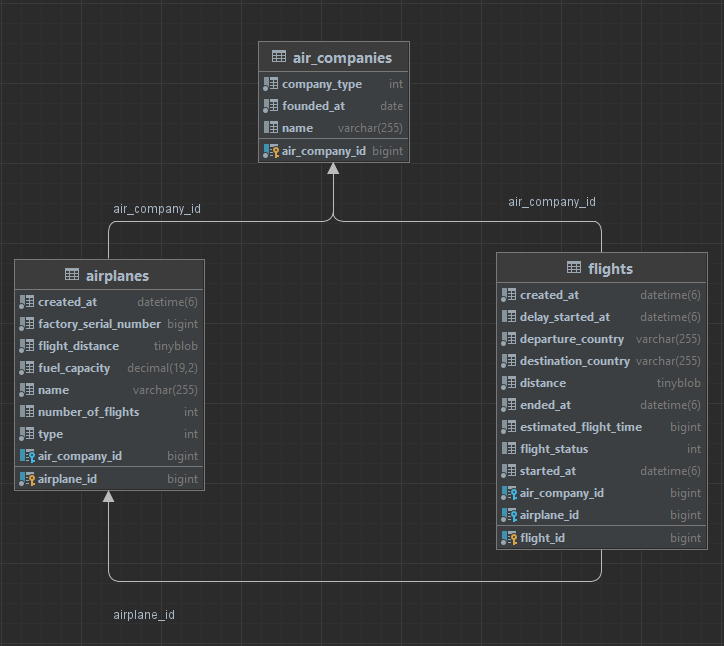

# Air Management<br>


## About a project
Air Management is a basic web application for online air management of flights.
It represents the work of a flight service and provides main CRUD operations and 
some specific methods.The web application consists of backend part, it implemented
using n-tiered architecture in accordance with SOLID and REST principles.
***

## Features
AirCompany ( /air_company ) :<br>

```
/{airCompanyId}

AirCompanyResponse getAirCompanyResponseById(Long id)
```

```
/{flightStatus}/{airCompanyName}

List<FlightResponse> getAllAirCompanyFlightsByStatus(String airCompanyName, FlightStatus flightStatus)
```

```
/create

AirCompanyResponse create(AirCompanyRequest airCompanyRequest)
```

```
/update/{airCompanyId}

AirCompanyResponse update(Long id, AirCompanyRequest airCompanyRequest)
```

```
/delete/{airCompanyId}

void deleteById(Long id)
```
 
Airplane ( /airplane ) :<br>


```
/{airplaneId}

AirplaneResponse getAirPlaneResponseById(Long id)
```

```
/create

AirplaneResponse create(AirplaneRequest airplaneRequest)
```

```
/update/{airplaneId}

AirplaneResponse update(Long id, AirplaneRequest airplaneRequest)
```

```
/update/company

AirplaneResponse updateCompany(AirplaneCompanyUpdate airplaneCompanyUpdate)
```

```
/delete/{airplaneId}

void deleteById(Long id)
```

Flight ( /flight ) :<br>

```
/{flightId}

FlightResponse getFlightResponseById(Long id)
```

```
/active_from_yesterday

List<FlightResponse> getAllActiveFlightStartedYesterday()
```

```
/delayed/status/completed

List<FlightResponse> getAllCompletedDelayedFlight()
```

```
/create

FlightResponse create(FlightRequest flightRequest)
```

```
/update/{flightId}

FlightResponse update(Long id, FlightRequest flightRequest)
```

```
/update/{flightId}/status/{flightStatus}

FlightResponse updateFlightStatus(Long flightId, FlightStatus flightStatus)
```

```
/delete/{flightId}

void deleteById(Long id)
```


***
## Model structure

***


## Technologies

* Java - 11
* Spring Boot - 2.2
* MySQL -  8.0.33
* Rest API
* Docker
* GIT

***

## Setup.

__Steps__
* Clone this repo
* Enter your MySQL credentials
* Start the project
